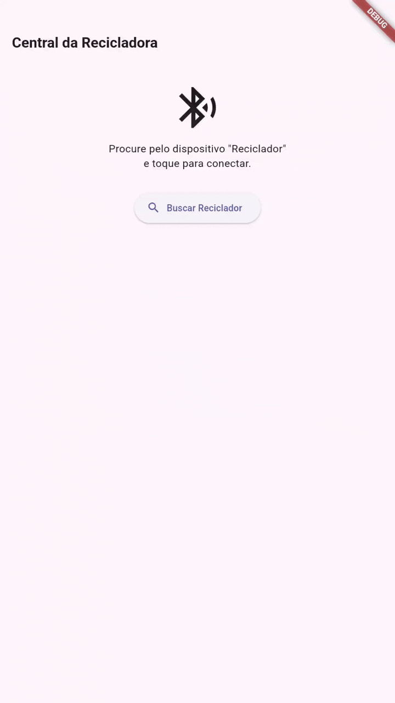

# ♻️ Recycler Project

Sistema de monitoramento de temperatura para máquina recicladora de plástico FDM, composto por firmware embarcado (ESP32-S3) e aplicativo Android desenvolvido em Flutter.

---

## 📁 Estrutura do Repositório

```
recycler_project/
├── reciclador/        # Firmware ESP32-S3 (Arduino)
└── recycler_monitor/  # Aplicativo Android (Flutter)
```

---

## 🔧 Hardware

### Componentes Necessários

- ESP32-S3
- 3× Termistores NTC
- Resistores de pull-down (para divisor de tensão)
- Fonte de alimentação adequada

### Conexões

| Termistor | Pino ESP32-S3 | Zona de Medição    |
|-----------|---------------|--------------------|
| T1        | GPIO 4        | Motor              |
| T2        | GPIO 5        | Cano de aquecimento|
| T3        | GPIO 6        | Bico de extrusão   |

### Configuração do Firmware

1. Abra a pasta `reciclador/` no Arduino IDE (ou equivalente).
2. Selecione a placa **ESP32-S3** no menu *Ferramentas > Placa*.
3. Selecione a porta serial correspondente ao dispositivo conectado.
4. Compile e grave o firmware na memória do microcontrolador.
5. Posicione cada termistor em sua respectiva zona de medição.
6. Ligue o sistema na energia.

---

## 📱 Software (Aplicativo Android)

### Instalação

1. Transfira o arquivo `.apk` para o dispositivo Android.
2. Habilite a instalação de fontes desconhecidas nas configurações do dispositivo, se necessário.
3. Instale o aplicativo.

### Uso

1. Abra o aplicativo e, na tela inicial, toque em **"Buscar reciclador"**.
2. Aguarde a conclusão da varredura BLE.
3. Selecione o dispositivo reciclador na lista exibida.
4. Após a conexão ser estabelecida, a **tela de monitoramento** carregará automaticamente, exibindo as temperaturas em tempo real das três zonas.



---

## 🛠️ Stack Tecnológica

| Camada    | Tecnologia                      |
|-----------|---------------------------------|
| Firmware  | C++ / Arduino (ESP32-S3)        |
| Comunicação | BLE (Bluetooth Low Energy)   |
| App       | Flutter / Dart                  |
| Plataforma | Android                        |

---

## 📄 Licença

Este projeto foi desenvolvido como parte de trabalho acadêmico na [UFPE](https://www.ufpe.br/).
